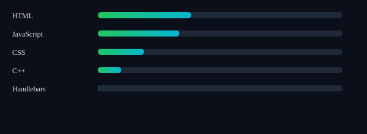
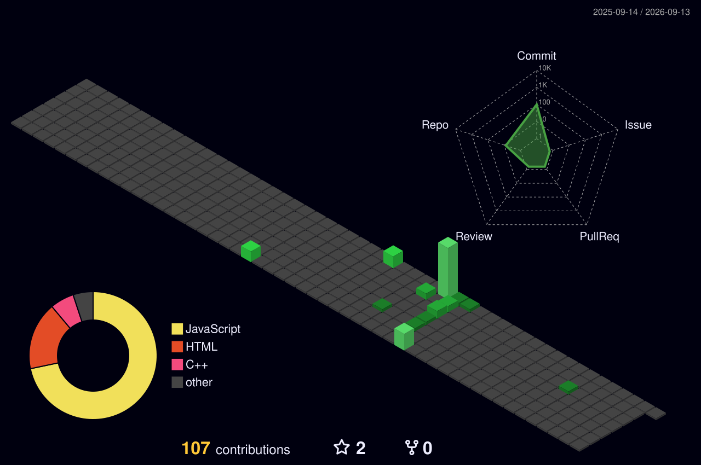

  
## Abdul Wahab

  
Socials

   
  

  
Socials

   
  
  

   <kbd>
    <kbd>Back-end</kbd>
     
     
    
    
     
    
  </kbd>
  <kbd>
    <kbd>Front-end</kbd>
     
     
     
     
    
  </kbd>
  <kbd>
    <kbd>Library/FrameWorks</kbd>
     
     
    
     
     
  </kbd>
  <kbd>
    <kbd>Outros</kbd>
     
     
    
     
    
    
    
    
  </kbd>
   
  

  

 
 

  
  

  
  

